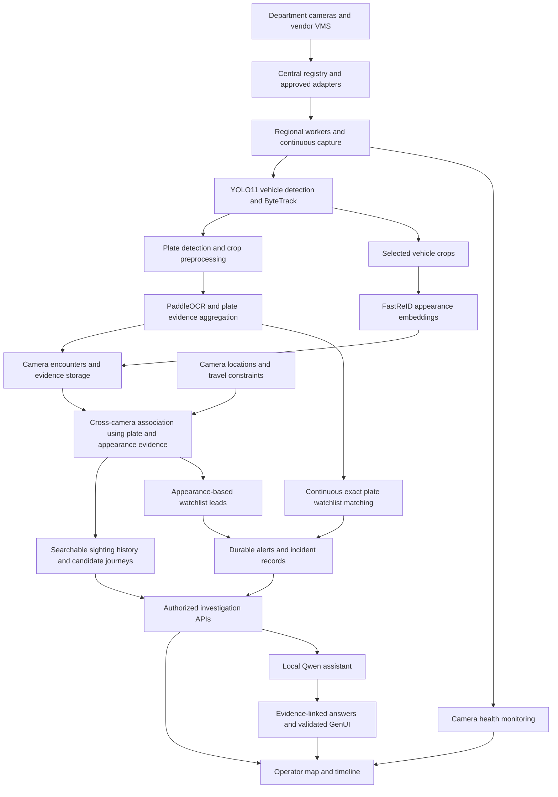
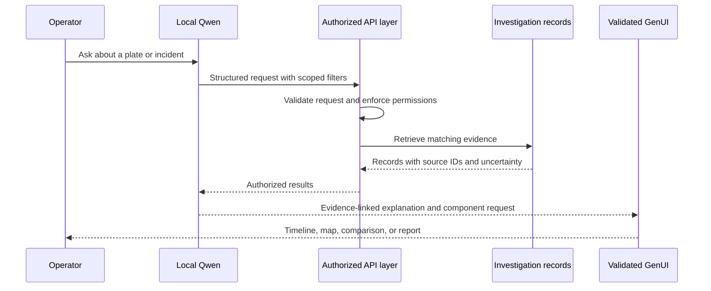

# SYNETRA Analytics Workflow Overview

**Purpose:** Describe the product we intend to build and how its integrated CCTV analytics will work for the Gujarat Police challenge.

**Product vision:** A unified platform that continuously observes authorized camera feeds, identifies vehicles by registration number, connects sightings across cameras, and generates evidence-backed watchlist alerts. Operators will investigate through a camera map, movement timeline, incident workspace, and a local AI assistant.

All intelligence will run on infrastructure we control: departmental servers, local machines, or self-hosted AWS workers. The design will not require cloud AI APIs. Camera credentials, access policies, model versions, and analytical rules will be centrally managed.

## 1. End to end architecture

The workflow will separate continuous video analysis from investigation assistance. Plate recognition, vehicle association, and watchlist matching will operate without waiting for an operator question or an LLM response.

**Two complementary outputs:** the analytics services will produce observations, associations, and alerts; Qwen will help operators retrieve, understand, and present those records.

## 2. Continuous analytics workflow

### Register cameras and normalize access

Vendors will register camera endpoints, supported protocols, ownership, department, location, and storage information. Approved adapters will translate vendor-specific APIs and VMS capabilities into a common camera identity and API contract.

A scheduler will assign cameras to regional workers. Workers will resolve credentials securely and check authentication, codec support, actual frame delivery, and source timing. The platform will distinguish a registered camera from a healthy, actively processed stream.

### Detect and track vehicles

Workers will decode feeds continuously and select frames according to configured analysis rates and available capacity. YOLO11 will detect vehicles, while ByteTrack will associate successive detections within each camera session.

Each passage will form a camera encounter. Tracking will continue when a plate is temporarily invisible, giving later frames another opportunity to produce readable evidence. A local track ID will never serve as a global vehicle identity.

### Locate and read number plates

A dedicated plate-trained detector will search original-resolution vehicle crops. The workflow will select clear, distinct plate crops using size, sharpness, glare, skew, and visibility checks.

Preprocessing will support perspective correction, bicubic enlargement, mild CLAHE contrast enhancement, and two-line plate layouts. PaddleOCR will decode the selected inputs. Configurable confidence thresholds and supported plate-format rules will rank candidates, while preserving raw text and competing readings.

The system will aggregate evidence across distinct frames rather than treating every OCR attempt as a new vehicle. It will retain unreadable or uncertain observations instead of inventing missing characters. Original crops will remain available beside processed variants.

### Persist encounters and evidence

Each encounter will retain camera and session identity, first and last observation times, plate candidates, appearance embeddings, supporting crops, and source frame or clip references. Stable observation IDs will prevent duplicate records when events are retried.

Source capture time will be used when its mapping is trustworthy. Otherwise, the timeline will explicitly identify receipt time and uncertainty. Reconnects and tracking resets will create visible session boundaries rather than silently joining unrelated passages.

## 3. Models and their responsibilities

| Component | Planned model or method | Role in the product |
|---|---|---|
| Vehicle detection | YOLO11, sized for the deployment hardware | Detect cars, motorcycles, buses, and trucks. |
| Tracking within a camera | ByteTrack | Associate vehicle detections over time and select useful frames. |
| Plate localization | Dedicated plate-trained YOLO detector | Locate number plates inside vehicle crops. |
| Plate recognition | PaddleOCR | Decode registration text, including supported two-line layouts. |
| Cross-camera appearance | FastReID with a vehicle-trained checkpoint | Produce visual embeddings and retrieve similar vehicle encounters. |
| Association engine | Plate evidence, embedding similarity, camera topology, and time rules | Connect compatible sightings while preserving ambiguity and conflicts. |
| Investigation assistant | Self-hosted Qwen3-1.7B with validated 4-bit quantization | Interpret operator requests and explain retrieved investigation records. |
| Watchlist matching | Deterministic matching and evidence rules | Generate auditable alerts without depending on an LLM. |
| Camera health | Stream diagnostics and calibrated image-quality signals | Identify unavailable, frozen, dark, obscured, or persistently blurry feeds. |

NVIDIA DeepStream and TensorRT will be evaluated as GPU execution and acceleration options. They will support the processing pipeline rather than act as additional recognition models. Model sizes, precision, and thresholds will be selected through representative accuracy and throughput tests.

## 4. How FastReID will support cross-camera tracking

A plate can be readable at one camera and blurred, occluded, or facing away at the next. FastReID will provide additional appearance evidence for these gaps. We will use a vehicle-trained checkpoint from the [FastReID framework](https://github.com/JDAI-CV/fast-reid).

The intended workflow will be:

1. **Establish a plate-linked reference.** A sufficiently supported plate reading or operator verification will link a vehicle encounter to a registration number.
2. **Create an appearance profile.** FastReID will encode selected clear vehicle crops into embeddings. The profile will retain its source images, camera, time, and model version.
3. **Encode candidate encounters.** Other cameras will also generate embeddings from selected vehicle crops, including encounters whose plates cannot be read. This makes comparison possible even when OCR fails there.
4. **Restrict the search.** The association service will filter candidates by authorized scope, time window, camera connectivity, and plausible travel time before comparing embeddings.
5. **Rank compatible sightings.** Appearance similarity will contribute alongside available plate evidence and other validated attributes. A strong contradictory plate will block automatic association.
6. **Expose the evidence level.** Appearance-only associations will appear as probable sightings, with their supporting crops and reasons. They will not inherit a confirmed plate identity solely from visual similarity.

**Example:** Camera A reads a vehicle's plate and supplies a clear vehicle crop. Camera B later captures a visually similar vehicle with a blurred plate. A strong appearance match in a plausible time window can add a probable Camera B sighting. A compatible readable plate at Camera C can provide further support for the journey.

To control computation, embeddings will be generated from a bounded set of representative crops per encounter, cached, and processed in batches. They will not be calculated for every frame. Uncertain associations will not automatically update a trusted vehicle profile, preventing one mistaken match from contaminating later searches.

## 5. How Qwen will assist investigations

We plan to run [Qwen3-1.7B](https://huggingface.co/Qwen/Qwen3-1.7B) locally with a validated 4-bit configuration. It will act as a language interface to authorized records and analytical services.

### Natural language investigation

An operator could ask:

- “Show this vehicle's sightings between 10 AM and noon.”
- “Which sightings have readable plates, and which depend on appearance?”
- “Explain why this watchlist alert was generated.”
- “Summarize cameras with persistent blur in this department.”

Qwen will translate a request into structured, allowlisted tool parameters. The backend will validate those parameters and enforce access permissions before retrieving records. The assistant will then summarize the returned evidence and link to the relevant encounters, alerts, or health events.

### Incident summaries and reports

Qwen will help draft a concise account of the observed sequence: where the vehicle was seen, the timestamp basis, which evidence supports an association, and where gaps or conflicts remain. Counts and travel-time calculations will come from backend services rather than free-form model estimates.

The chosen model is a text model. It will consume structured analytics and retrieved records; image interpretation and plate recognition will remain the responsibility of the vision pipeline. It will not read raw CCTV video, invent a registration number, or independently declare a watchlist match.

### Contextual user interface

Qwen will be able to request approved presentation components through a validated JSON schema. For example, a vehicle query can produce a map and timeline; an ambiguous match can produce a crop comparison; a health query can produce a camera-status table.

The frontend will render trusted components with server-provided data. Model output will not execute arbitrary code or bypass permissions. Changes such as adding a watchlist entry or sharing an incident will require an explicit authorized action.

Qwen will run as an independently budgeted service. Detection, historical search, and watchlist alerts will continue when the assistant is busy or unavailable.

## 6. Vehicle search and continuous watchlist alerts

### Historical search and live follow

The platform will index eligible sightings continuously, before the operator knows which registration to search for. A query will return historical encounters; a saved follow will update as new observations arrive. Searching alone will not silently create a watchlist rule.

The journey view will distinguish:

- **Plate-supported sightings:** observations supported by readable plate evidence.
- **Appearance-based candidates:** probable associations supported by FastReID and context.
- **Inferred road segments:** suggested connections between observed camera checkpoints.

The route engine will use camera coordinates, location provenance, road topology, and time constraints. It will not present an unobserved road segment as a directly recorded movement. Conflicting evidence and duplicate or replayed footage will remain visible for review.

### Watchlist matching and alerts

Authorized users will manage representative watchlist records containing registration numbers and incident context. Incoming plate evidence will be matched continuously against active records within the permitted scope.

Exact plate matching will have a direct alert path that does not wait for FastReID or Qwen. When a watchlisted vehicle has a suitable appearance profile, the association service can also produce separately labeled appearance-based leads. A plate string alone is not enough to create an appearance profile.

One camera encounter and watchlist record will produce one alert, with later supporting observations updating its evidence. Alerts will include camera, time, evidence type, plate text when available, crops, and uncertainty. Delivery retries, acknowledgement, assignment, and audit history will support operational handling.

## 7. Bonus features

**Delivery priority:** scalability, continuous analytics, watchlist alerts, and the observed camera map are core requirements. We will next add contextual incidents and named-recipient sharing, camera health and crop APIs, sensitive-area rules, and possible routes. Plate-anomaly review and traffic-density analytics follow after the core workflow passes validation.

| Feature | How it will work | Operator benefit |
|---|---|---|
| Vendor onboarding and unified API | Normalize approved vendor APIs, cameras, VMS capabilities, and storage references behind stable camera identities. | One way to manage heterogeneous sources. |
| Department and role-based access | Enforce camera, investigation, watchlist, export, and sharing permissions in backend services. | Controlled access across departments and vendors. |
| Camera health and maintenance | Combine frame age, connection errors, repeated-frame checks, blur, brightness, and scene-change signals with calibrated baselines. | Identify dead, frozen, blurry, dark, or potentially covered cameras. |
| Evidence crop and clip APIs | Retrieve an authorized region or time interval from retained evidence or a supported source archive, with source references. | Precise incident context without manually searching full recordings. |
| GPS map and route hypotheses | Place observed checkpoints on a map and show plausible connections with clear evidence labels. | Understand vehicle movement and investigate coverage gaps. |
| Traffic density analytics | Aggregate calibrated lane counts, occupancy, queue length, and congestion trends. | Support traffic decisions; automated signal control will require a separate authorized integration. |
| Sensitive-area rules | Apply configurable zones, schedules, and event rules to sightings, with department permissions and audit. | Prioritize relevant incidents around designated locations. |
| Unreadable and unusual plate review | Distinguish unreadable, not visible, potentially absent, and unusual-format plates using retained evidence. | Flag cases for review without treating detection failure as proof of an offence. |
| Incident and conversation sharing | Share an investigation workspace with selected recipients using expiry, revocation, and access checks at retrieval. | Collaborate with evidence and an auditable discussion. |
| Qwen summaries and GenUI | Turn authorized records into evidence-linked explanations and appropriate map, timeline, table, or comparison components. | Faster investigation with less manual navigation. |

Camera policies, thresholds, plate formats, watchlists, zones, and retention will be configurable. The product demonstration will use actual observations and clearly identified representative watchlist records, without fabricated vehicle detections or hardcoded target plates.

### How we will implement the feature set

| Feature | Implementation approach | Proof before release |
|---|---|---|
| Scalable analytics and alerts | Camera ownership leases, bounded queues, idempotent observation ingestion, and an alert outbox with retry-safe delivery. | Replayed events do not duplicate alerts; worker recovery and one-, two-, and four-worker capacity tests are measured. |
| Map and possible routes | Store camera geometry/provenance in PostGIS; build ordered encounters and a camera connectivity graph; filter route candidates by road links, travel time, and clock uncertainty. | Known journeys and impossible transitions are tested; observed checkpoints remain separate from inferred road segments. |
| Incidents and shared investigation chat | Link sightings, alerts, and evidence into incident context; let Qwen summarize scoped records; share selected conversation snapshots with named recipients, expiry, and revocation. | Unauthorized, expired, and revoked access fails, including access to attachments; cited evidence opens correctly. |
| Sensitive areas | Store zone polygons, camera associations, calibrated boundaries, schedules, and versioned rules; evaluate committed encounters and deduplicate rule events. | A nearby camera is not treated as proof of zone entry; boundary, schedule, and repeated-frame cases pass. |
| Camera health and crop API | Combine stream diagnostics with persistent image-quality signals; create bounded crops from authorized retained evidence IDs. | Healthy night/static scenes, real faults, recovery, invalid crop bounds, and permissions are tested. |
| Plate-anomaly review | Preserve readable, unreadable, not-visible, possibly-absent, and unusual-format outcomes; use versioned rules and a labeled review workflow. | Missing detections do not automatically imply missing plates or offences; false positives and unknowns are reported. |
| Traffic analytics | Calibrate lane regions and counting lines; count track crossings, aggregate occupancy and queues, and apply persistent congestion rules. | Compare against manually labeled clips and expose coverage gaps; no direct signal actuation in this release. |

The [feature implementation plan](BONUS_FEATURE_IMPLEMENTATION_PLAN.md) specifies the records, proposed APIs, owners, dependencies, and acceptance checks for each module. All modules will reuse the shared encounter and evidence contracts rather than create independent plate histories.

## 8. Integration and data design

The platform will use separate services with versioned contracts:

| Service | Responsibility |
|---|---|
| Registry and identity | Camera inventory, vendor adapters, department permissions, and configuration. |
| Media and analytics workers | Capture, sampling, vehicle tracking, plate OCR, selected-crop embeddings, and health signals. |
| Observation ingestion | Validate events, persist them idempotently, and acknowledge committed writes. |
| Evidence storage | Retain original crops, frames, and available clips with hashes, access policies, and retention. |
| Association and investigation | Combine plate and appearance evidence; serve history, journeys, and live follows. |
| Watchlist and alerts | Manage watchlists, match observations, publish durable alerts, and track acknowledgements. |
| Qwen and presentation | Retrieve scoped records and generate grounded explanations and validated UI requests. |

PostgreSQL/PostGIS will hold structured records and geographic metadata. An indexed vector store such as pgvector will support scoped appearance retrieval. S3-compatible storage will hold evidence. Workers will retain a durable local spool until central ingestion acknowledges a commit; an event broker can decouple regional producers and consumers. An alert outbox will preserve delivery work across service restarts.

An observation will carry a stable ID, camera and department scope, source session and local track, timestamp and its basis, plate candidates, appearance references, evidence locations, and model/configuration versions. Association records will preserve the evidence and rule version behind each proposed link.

## 9. Scale, resilience, and deployment

**Regional processing:** The design will support multiple media and analytics workers close to source cameras. One API contract will span multiple replicas; central registration will not mean funneling every video stream through a single machine.

**Bounded work:** Sampling rates, queue sizes, best-frame selection, embedding frequency, and assistant concurrency will have explicit budgets. Under pressure, the system will prioritize timely capture, plate analysis, and deterministic alerts, with visible degradation of secondary work.

**Recovery:** Camera leases and fencing will prevent conflicting worker ownership. Reconnect backoff, independent worker heartbeats, durable spooling, idempotent ingestion, and alert retries will support recovery. Worker failover will preserve recorded evidence and explicitly mark any capture or tracking gap. Authentication failures will be reported separately from ordinary stream interruptions.

**Deployment:** Pinned model artifacts, configuration templates, database migrations, health checks, and container profiles will support local and departmental installations. GPU profiles will be tested separately from CPU deployments. Backups, restore procedures, retention, and credential rotation will be part of the operating plan.

**Capacity proof:** We will validate the approximately 50-camera evaluation scope and build toward the 80,000-camera architecture through measured regional scaling. Reports will include per-camera processing coverage, stage and alert latency, exact-plate accuracy, false associations, GPU/CPU/RAM use, bandwidth, storage, and recovery time. One-, two-, and four-worker tests and realistic replay/load tests will separate measured results from capacity projections.

## 10. Presentation summary

“SYNETRA will combine central camera management with continuous vehicle intelligence. YOLO and PaddleOCR will establish plate evidence, FastReID will help recover probable sightings when plates are unclear, and the association engine will organize those observations into an evidence-backed journey. Deterministic rules will generate watchlist alerts, while a locally hosted Qwen assistant will help operators search, explain, and present the results. Regional workers and durable services will allow the platform to grow across departments.”

**Suggested walkthrough:** camera onboarding → vehicle detection → readable plate and appearance profile → probable sighting on another camera → movement timeline → watchlist alert → Qwen explanation and contextual UI → camera health and regional scale.
