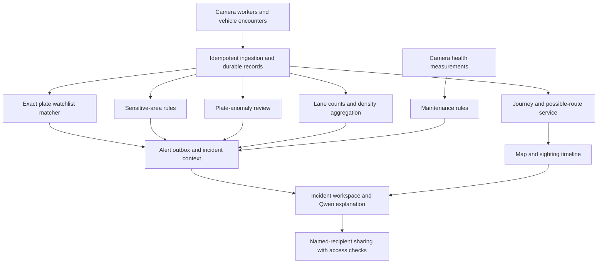

# SYNETRA Analytics Feature Implementation Plan

This plan describes how we will build the agreed features into the target product. P0 is the required evaluation workflow; P1 strengthens the investigation experience; P2 follows once that workflow is reliable. These are implementation commitments to validate, not completed capabilities or fixed delivery dates.

## 1. Delivery order

| Order | Scope | Priority | Lead |
|---|---|---|---|
| 1 | Continuous analytics, exact-plate watchlist alerts, persistence, access control, and measured capacity | P0 | Meet and Samay |
| 2 | Camera map, observed sighting timeline, and evidence access | P0 | Meet and Shreyas |
| 3 | Contextual incidents, recipient-specific investigation sharing, camera health, and crop APIs | P1 | Meet and Shreyas |
| 4 | Sensitive-area rules and possible-route generation | P1 | Meet, with Samay and Shreyas |
| 5 | Plate-anomaly review | P2 | Samay and Shreyas |
| 6 | Traffic-density analytics and decision support | P2 | Samay and Shreyas |

FastReID and Qwen are part of the target architecture. FastReID adds separately labeled appearance-based leads; Qwen explains retrieved evidence and selects validated UI components. Neither is a prerequisite for generating an exact-plate alert. Camera health starts alongside the core because trustworthy availability is necessary for every other feature.

## 2. Shared foundation

All features will consume the same versioned observation and encounter records. Workers will not write separate, inconsistent plate histories for the map, incidents, and watchlist.

- **Identity:** camera UUID, department scope, stream session, local track, stable observation ID, and evidence IDs.
- **Time:** source time when validated, receipt time, uncertainty, and replay/live provenance.
- **Evidence:** original crop/frame, source bounds, plate alternatives, model versions, and transformation history.
- **Rules:** explicit rule ID, version, scope, activation period, and reason for each result.
- **Persistence:** PostgreSQL/PostGIS, authorized evidence storage, worker-side durable spooling, and transactional alert outbox.
- **Delivery:** acknowledgement after commit, safe replay, and authenticated reconnectable alert/event streams.

Each endpoint below is a proposed contract. Existing routes will be checked before implementation so compatibility is preserved. API access, background rules, event streams, assistant tools, and shared evidence will all enforce the same department permissions.

## 3. Scalability, analytics, and alerts

**What we will build:** a continuously running service that processes admitted feeds with an explicit capacity budget and emits durable, deduplicated alerts.

**Implementation:**

1. Assign each camera to one worker using renewable leases and fencing generations. Keep tracker state isolated by camera and session.
2. Bound decode handoff, detection, OCR, and embedding queues. Measure discarded samples and queue age; prioritize timely plate analysis over secondary tasks.
3. Persist observations using stable IDs. Match eligible normalized plate candidates against active, scoped watchlists, retaining uncertainty and the watchlist version.
4. Use a stable alert key based on encounter, watchlist record, and rule identity. Update supporting evidence rather than emitting another alert for every frame; record rule-version changes as revisions unless policy explicitly creates a new alert.
5. Commit alert delivery work through an outbox. Retry notification delivery and let clients resume from an event cursor. Qwen or ReID outages must not block this path.
6. Scale stateless APIs and partition camera ownership across workers. Tune database indexes and retention before introducing unnecessary services.

**Records:** observations, encounters, worker leases, watchlist entries, alert revisions, outbox, and delivery acknowledgements.

**APIs:** `POST /internal/v1/observations:batch`, `GET /api/v1/alerts`, `GET /api/v1/alerts/stream`, and `POST /api/v1/alerts/{id}/acknowledgements`.

**Validation:** repeat an event and restart a consumer without duplicating alerts; interrupt a worker and measure the recovery gap; compare one, two, and four workers on equivalent workloads. Record actual per-camera analysis FPS, source availability, p95 observation-to-alert latency, dropped work, and resource use. Source/capture timing and receipt-based latency must be reported separately. An 80,000-row inventory is not evidence of 80,000-stream analytics capacity.

## 4. Camera map and possible routes

**What we will build:** a map of observed camera checkpoints, with a time-ordered sighting history and clearly labeled possible road routes between sightings.

**Implementation:**

1. Store camera coordinates, direction, accuracy/provenance, and any surveyed field of view in PostGIS. Unknown coordinates remain unknown.
2. Group distinct observations into encounters and retrieve them by normalized plate, scope, and time interval. Preserve repeated visits and late-arriving observations.
3. Maintain a versioned camera connectivity graph. Edges describe physically plausible links and travel-time bounds derived from an available road graph or reviewed configuration.
4. For adjacent observations, compute elapsed-time intervals including clock uncertainty. Exclude implausible links; return competing paths when the evidence cannot distinguish them.
5. Draw observed checkpoints and their evidence separately from dashed inferred road segments. If road data is missing, use a labeled schematic connection rather than a claimed road route.
6. Query FastReID candidates only within permitted time/region/topology constraints. Preserve their association reasons and keep them distinct from plate-supported sightings.

**Records:** camera locations, connectivity edges, encounters, journey associations, inferred path geometry, source/rule versions, and reviewer decisions.

**APIs:** `GET /api/v1/map/cameras`, `GET /api/v1/vehicles/{plate}/journey`, and `GET /api/v1/journeys/{id}/route-candidates`.

**UI:** map, synchronized timeline, filters for evidence type, clickable crops, missing-location states, and uncertainty labels.

**Validation:** use a known multi-camera journey plus hard negatives, repeated visits, missing GPS, and reversed or uncertain clocks. Verify that impossible links are rejected and an inferred path never becomes an observed checkpoint. Missing topology must produce an explicit unknown result, not a fabricated route.

## 5. Incidents, contextual APIs, and shared chat

**What we will build:** an investigation workspace that collects related alerts and sightings and can be shared with a specific authorized colleague.

**Implementation:**

1. Create incident records with owner, scope, status, linked alerts, sightings, evidence, notes, and audit history. Correlation will use explicit rules or operator action rather than silently merging every matching plate string.
2. Serve a bounded context object containing the incident timeline, match reasons, uncertainty, evidence IDs, and record versions.
3. Give local Qwen access through allowlisted, read-only investigation tools. Generate summaries with evidence citations and validated requests for map, timeline, or comparison components.
4. Persist investigation messages with their author, cited evidence, and the context revision used. Qwen3-1.7B will explain structured records; it will not analyze raw video or invent plate identities.
5. Add recipient-specific shares containing investigation ID, recipient identity, access level, expiry, revocation, and audit. Default to a selected conversation snapshot and selected incident context; ongoing updates require an explicit share mode.
6. Require sign-in and recheck both share permission and underlying evidence authorization on every request. A copied URL alone will not grant access. Revoke access immediately and issue short-lived evidence URLs after authorization.

**Records:** incidents, incident links, investigation threads/messages, context revisions, shares, and access audit.

**APIs:** `POST /api/v1/incidents`, `GET /api/v1/incidents/{id}/context`, `POST /api/v1/investigations/query`, `POST /api/v1/investigations/{id}/shares`, and `DELETE /api/v1/investigations/{id}/shares/{share_id}`.

**Validation:** show one complete alert-to-incident-to-shared-conversation flow. Test an unrelated recipient, expired/revoked shares, restricted attachments, and a user whose department access changes. Test missing evidence and assistant unavailability; the incident and normal investigation UI must remain usable.

## 6. Sensitive-area database and rules

**What we will build:** configurable geographic zones with scoped, auditable event rules and appropriate evidence requirements.

**Implementation:**

1. Store named zone polygons, owning department, classification, active schedules, timezone, rule versions, and permitted cameras. Record the basis for camera-to-zone associations.
2. Separate **a sighting at a camera associated with a zone** from **a vehicle observed entering the zone**. Entry requires a calibrated image boundary or a trustworthy mapping of the vehicle trajectory into the zone.
3. Evaluate committed encounters against active rules. Initial rules will cover watchlisted vehicle sightings at associated cameras and validated boundary crossings during a configured schedule.
4. Use distinct-event support, persistence windows, cooldowns, and stable event keys to prevent repeated frames from producing repeated alerts.
5. Attach zone ID, rule version, time basis, match method, and evidence to the incident. Qwen may explain the rule result but will not decide whether the condition occurred.

**Records:** zones, zone-camera associations, calibrated boundaries, schedules, zone rules, rule evaluations, and alert links.

**APIs:** `POST/GET /api/v1/zones`, `PATCH /api/v1/zones/{id}`, `POST /api/v1/zones/{id}/rules`, and `GET /api/v1/zones/{id}/events`.

**Validation:** test inside/outside cases, boundary ambiguity, incorrect coordinates, inactive schedules, timezone boundaries, and repeated frames. A camera near a zone must not automatically prove that a vehicle entered it. Appearance-based watchlist leads must retain that weaker evidence label.

## 7. Camera health and evidence crop APIs

**What we will build:** actionable fleet diagnostics and a traceable way to request incident crops.

**Implementation:**

- Collect frame/packet age, decode errors, reconnects, analysis lag, and worker heartbeat independently. Distinguish offline, authentication failure, healthy-but-idle, overloaded, and unknown states.
- Sample frames for persistent blur, darkness, frozen content, and scene obstruction signals. Compare against camera-specific baselines and use persistence/hysteresis to reduce flickering alerts. Natural darkness and static scenes need negative examples.
- Group a continuing fault into one health incident; append state changes and a recovery event. Authentication failures will use bounded retries and an operator action state.
- Accept crop requests by scoped evidence ID and bounded source-image coordinates. Retain the parent hash, source dimensions, crop bounds, and transformation record. Never accept an arbitrary URL to fetch with server credentials.
- For live context, capture and retain a frame first, then crop that stable evidence item. If source evidence has expired, return an explicit unavailable state.

**APIs:** `GET /api/v1/cameras/{id}/health`, `GET /api/v1/fleet/health`, and `POST /api/v1/evidence/{id}/crops`.

**Validation:** reproduce disconnect, authentication failure, frozen footage, blur, and obstruction conditions alongside healthy night/static scenes. Verify persistence and recovery behavior. Test out-of-bounds crops, oversize requests, expired evidence, and cross-department access.

## 8. Unreadable, absent, or unusual plate review

**What we will build:** an evidence-backed review queue, not an automatic legal verdict.

**Implementation:**

1. Introduce explicit outcomes: `readable`, `unreadable`, `not_visible`, `possibly_absent`, and `unusual_format`. Keep model evidence separate from any reviewer classification.
2. Use versioned, jurisdiction-appropriate plate-format rules to flag text for review. Preserve alternative readings and avoid forcing every plate to a fixed length or modifying characters to fit a watchlist.
3. Treat missing detection as `not_visible` or `unknown` unless clear, suitable views of the expected plate region support another conclusion across distinct frames.
4. Collect labeled examples of clearly present, obscured, absent, and unusual plates. Evaluate a dedicated plate-presence/anomaly classifier only if it improves this task over detector and quality signals. Camera orientation and vehicle type must be considered.
5. Create review events with original frames, attempted crops, candidate text, and the reason for escalation. Only reviewed decisions or separately validated rules may assign a compliance category.

**Records:** plate assessments, evidence references, format-rule versions, review decisions, and corrections.

**APIs:** `GET /api/v1/plate-reviews` and `POST /api/v1/plate-reviews/{id}/decisions`.

**Validation:** include rear/front views, two-wheelers, blur, occlusion, low light, small plates, supported alternative formats, and truly absent plates where ground truth is available. Report false positives and unknown outcomes. Failure to read a plate must not become an automatic offence alert.

## 9. Traffic density and decision support

**What we will build:** calibrated traffic measurements and congestion alerts. Direct traffic-signal actuation is outside this release scope.

**Implementation:**

1. Configure lane/road regions, counting lines, travel direction, and calibration metadata per camera. Record supported classes and the conditions under which measurements are meaningful.
2. Count line crossings from stable tracks, rather than summing detections per frame. Use crossing direction and per-track state to reduce duplicate counts. Mark windows affected by reconnects or tracking gaps.
3. Aggregate counts per interval, region occupancy, and sustained queues. Express image-space occupancy as an occupancy measure; do not call it vehicles per kilometre without physical calibration.
4. Estimate stationary queues only where frame coverage and trajectory quality support it. Configure congestion thresholds and persistence windows per location.
5. Publish windowed metrics and evidence-linked congestion alerts. Show coverage and freshness alongside the values. Qwen can summarize changes from these metrics; backend code calculates them.

**Records:** lane configuration, calibration versions, crossing events, traffic windows, coverage statistics, congestion rules, and alerts.

**APIs:** `POST /api/v1/cameras/{id}/traffic-config`, `GET /api/v1/traffic/metrics`, and `GET /api/v1/traffic/alerts`.

**Validation:** compare counts and queue estimates with manually labeled clips at different traffic levels. Test occlusion, parked vehicles, camera movement, reconnects, and low sampling rates. Measure error and coverage; do not present unreliable intervals as zero traffic. Signal integration requires its own operator controls and evaluation.

## 10. Integrated demonstration and release gates

The preferred demonstration is one connected investigation:

1. A plate-supported sighting produces a watchlist alert.
2. The map opens its camera checkpoint and original evidence.
3. A later sighting triggers a sensitive-area rule with the correct spatial evidence label.
4. A FastReID lead appears separately where the plate is unclear.
5. The incident context collects the timeline, reasons, and evidence.
6. Qwen explains the incident with citations, and an authorized recipient opens the shared conversation.
7. A camera-health event demonstrates a visible fault and recovery. Traffic and plate-review features receive separate demonstrations after validation.

Before enabling each feature, its owner will define the labeled test set and acceptance thresholds appropriate to the task. Common gates are correct authorization, real evidence links, retry safety, bounded resource use, measured latency, and explicit unknown states. Feature flags will keep unfinished or unvalidated modules out of the operational demonstration.

**Ownership:** Meet owns schemas, APIs, permissions, persistence, rules, and sharing. Samay owns video measurements, model validation, geometry, tracking quality, and load testing. Shreyas owns maps, timelines, incident/review screens, GenUI, and the end-to-end acceptance harness. Work is sequenced by dependencies rather than assuming every bonus fits before the core is proven.
