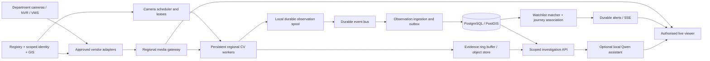

# SYNETRA — final product and hackathon execution plan

Prepared 18 September 2026. Owners: Meet (platform/integration), Samay (video/ML), Shreyas (operator experience/QA). This is a proposed implementation plan, not a claim that the system already passes its acceptance gates.

**Product decision:** build a self-hosted, federated CCTV investigation platform, portable to departmental on-premises infrastructure. An operator enters a registration number, receives an evidence-backed chronological journey, and receives continuous watchlist alerts even when no browser is open. Preserve departmental VMS and recording systems. Centralise identity, policy, camera inventory, searchable observations and incidents; process video regionally.

**Delivery decision:** prove the complete workflow on the supplied evaluation feeds, approximately 50 cameras. Present an independently reproducible capacity model and measured scaling experiments for the 80,000-camera design. An 80,000-row registry or synthetic event test does not prove 80,000 concurrent video analytics streams.

## 1. What the official challenge actually asks for

The [official problem and submission page](https://sentinel.gujarat.gov.in/problems), retrieved on 18 September, specifies a registry/GIS foundation, heterogeneous feed integration, continuous analytics/watchlist matching, designated-vehicle movement history and evidence of scalability. Its evaluation also considers security, feasibility and submission completeness. Bonus features do not replace a successful mandatory test. Choose **Hybrid: Model 1 foundation + Model 2 viewing/analytics + Model 3 adapter federation**, with regional compute supporting statewide growth. Do not claim to have replaced every department's VMS.

The current official page lists **28 September 2026** for submission and **12–13 October 2026** for the event. Retain the team's earlier **20 September build freeze and 21 September submission target**, in IST, pending confirmation. Prepare presentation/HLD, an own-feed recording of at most 2–3 minutes, a government-feed recording and timestamped output report, and accessible submission links. Source: [official requirements](https://sentinel.gujarat.gov.in/problems).

Planning inputs: the user's brief, the attached model discussion, the local repository audit, and primary technical sources linked below. The shared ChatGPT page did not expose its conversation text to the research tool; the supplied attachment provided that discussion. The user confirmed **local laptop now, AWS later**. Read-only hardware inspection found **Apple M2, 8 GB unified RAM, 8 CPU cores and 8 GPU cores**. Use one native CV worker initially and CPU or validated Apple acceleration; CUDA/DeepStream belongs to the later NVIDIA host. Avoid co-running the optional LLM/VLM with the full local stack until memory is measured. AWS hosts our own model processes, not a third-party intelligence API. AWS budget/region/quota, full resource-portal access, exact camera coordinates and deployment permissions remain unconfirmed.

## 2. Release scope and acceptance contract

| Priority | Deliverable | Demonstrable acceptance condition |
|---|---|---|
| P0 | Unified camera registry and department RBAC | Import all supplied camera records; authenticate two vendor/department scopes; forbidden cross-scope reads/writes fail; metadata edits audited; export a metadata/coverage-gap report. |
| P0 | Heterogeneous integration | Record success/failure for every supplied endpoint; demonstrate at least two actual source systems; catalogue discovery is distinct from successful media decode. |
| P0 | Continuous analytics | Every reachable admitted camera is processed without an open viewer; failures and capacity rejections are visible. |
| P0 | Real plate recognition | A dedicated plate detector and OCR produce retained raw crops, candidate text and scores; unreadable plates stay unknown. |
| P0 | Vehicle search and journey | Enter an arbitrary evaluator-provided plate; retrieve observations in event-time order with camera, location provenance, timestamp, crop and clip references. |
| P0 | Watchlist database and alerts | Add/update/deactivate representative records via API/UI; confirmed matches create durable deduplicated alerts; alerts survive process restart. |
| P0 | Real evidence | Each displayed observation resolves to its actual retained source frame; no stock evidence, invented location, timestamp or confidence. |
| P0 | Performance and resilience report | Execute the benchmark protocol in BENCHMARK_AND_OPERATIONS.md; publish measured values and limitations, including failed tests. |
| P0 | Deployment and submission package | A second host can start the pinned release with documented prerequisites; documents, videos and report links are checked by another teammate. |
| P1 | Camera health and evidence crop API | Detect tested offline/blackout/frozen/blur conditions with reason and confidence; crop real retained evidence through a scoped API. |
| P1 | Grounded local assistant and GenUI | Answers cite incident records and render validated components; outage does not interrupt detection or alerts. |
| P1 | Vehicle appearance candidates | Vehicle-trained ReID retrieves plausible candidates; inferred sightings remain visibly separate from plate-confirmed sightings. |
| P1 | Contextual incidents and named-recipient sharing | Incident context links real sightings and alerts; scoped conversation shares expire and revoke, including attachment access. |
| P1 | Sensitive-zone rules and route hypotheses | Use versioned geometry, schedules and connectivity; distinguish camera association from observed zone entry and observed checkpoints from inferred routes. |
| P2 | Plate-anomaly review and traffic-density analytics | Validate on labeled examples; missing plate detection is not an offence and low coverage is not zero traffic. |
| Later | Broad VMS marketplace, adaptive traffic control, statewide HA deployment | Architecture and backlog only until implemented and measured. |

No face recognition or person-watchlist system is needed to meet this vehicle test. No government database connection is claimed without an authorised working integration. The representative watchlist is explicitly permitted; it contains user-managed demonstration records, not fabricated detection results. Test fixtures and load generators live in an isolated test namespace and never populate the live operational dashboard.

## 3. Current code: retain, repair, replace

| Existing area | Decision |
|---|---|
| `backend/registry/`, migrations, vendor onboarding | Retain. Add scoped operator identity to the analytics gateway, media probes, worker assignments and source capability reporting. |
| Registry approximate-coordinate enrichment | Preserve provenance, but do not treat city centroids as surveyed camera positions. Confirm with resource metadata or mark location unknown/approximate. |
| `backend/routers/stream.py` | Extract inference from HTTP generators. Remove fabricated `GJ01-XX-*` plates; isolate tracker/OCR state by camera and session. Viewer consumes media, never owns inference. |
| `edge_node.py` | Reuse reconnect/decode concepts; read registry assignments, not an independent hardcoded catalogue. Remove `TRK-*` as a plate substitute and credential-bearing logging. |
| `backend/routers/events.py` | Converge all observations on one ingestion transaction and rule path. No separate dashboard/edge semantics. |
| `backend/routers/vehicles.py`, `watchlist.py` | Replace process-local dictionaries/lists with PostgreSQL records and migrations. Retain useful API compatibility. |
| `backend/data/database.py` | Remove seeded fake operational detections. Serve persisted events, not a process-local list diverging from the DB. |
| `backend/services/video_pipeline.py` | Remove simulated threat fallback and first-event stop. Do not let old VLM/upload flow decide plate identity. |
| `backend/services/reid.py` | Current ImageNet ResNet18/person-shaped preprocessing is not a validated vehicle ReID model; do not advertise it as one. |
| `frontend/src/pages/LiveFeed.jsx`, `EvidenceModal.jsx` | Keep useful navigation/map components. Remove stock footage, static confidence/speed, inferred LIVE status and localhost assumptions. |
| Groq/Gemini and automatic model downloads | Remove runtime cloud-intelligence calls; package all models locally; run a blocked-egress acceptance test. |
| Existing synthetic-noise benchmark | Replace as evidence of video capacity. Noise can exercise plumbing but cannot establish OCR or journey accuracy. |

## 4. Architecture that can grow without a rewrite

**Control plane:** existing FastAPI registry/API, PostgreSQL/PostGIS, department/user roles, source configuration, camera leases, watchlist CRUD, search and incidents. One versioned API contract can have several replicas; it does not mean one machine or one process serving 80,000 video streams.

**Media plane:** regional MediaMTX relay where appropriate, FFmpeg/GStreamer decode, isolated CV worker processes, local encoded-video ring buffer, S3-compatible evidence storage. Share one upstream acquisition where the adapter permits it. Open playback streams on demand; keep configured analytics workers active independently. MediaMTX supports several streaming protocols and recording/playback; codec compatibility and any required transcoding must still be tested. [MediaMTX](https://github.com/bluenviron/mediamtx)

**Event plane:** choose NATS JetStream for durable observations and consumer groups; start with one persistent instance in the demo and use three replicas on separate hosts for the HA profile. Explicit acknowledgement follows DB commit. Keep a worker-side SQLite spool until durable delivery is acknowledged. A transactional DB outbox handles alert publication. JetStream redelivery means all consumers must be idempotent. [NATS persistence/delivery model](https://docs.nats.io/concepts/jetstream)

**Data plane:** PostgreSQL/PostGIS is authoritative for metadata, observations, watchlists, alerts and audit. Partition high-volume observations by date; index `(tenant_id, plate_normalized, observed_at)` and `(camera_id, observed_at)`. Add region/shard routing when measured write or retention limits require it. Embeddings use pgvector with region/time candidate filtering; never compare every vehicle with every other vehicle statewide.

**Deployment scope:** Docker Compose for the deadline; configurable replicas and camera assignments for measured scale tests. Kubernetes/Helm, multi-region metadata replication and automated DB failover are the production deployment track, not claims about the initial Compose deployment.

**Deadline simplification:** if introducing JetStream threatens G1, use the same versioned batch-ingestion contract over authenticated HTTP, retaining the worker's durable spool until DB-commit acknowledgement and the PostgreSQL alert outbox. This is the approved smaller deployment, not a claim of broker HA. Record which transport was actually tested. Preserve the transport boundary so regional JetStream can be introduced after the end-to-end core works; do not add several competing brokers.

## 5. Model decisions and selection gates

The model stack is a recommendation based on integration risk and the present codebase. Published generic benchmarks do not establish Indian ANPR accuracy. Pin exact model revisions, SHA-256 hashes, runtime versions, precision and preprocessing in a release manifest after the bake-off.

| Stage | Deadline choice | Gate / alternative |
|---|---|---|
| Vehicle detection | **YOLO11n on the laptop; YOLO11s FP16 as the AWS candidate** | Compare n/s on actual feed crops. Choose the smallest model meeting vehicle recall and latency gates; use m only if it earns a measured gain. Base weights detect vehicles, not number plates. |
| Per-camera tracking | **ByteTrack**, one tracker per camera/session | Keep IDs local. Consider NvDCF only with a working DeepStream backend. Do not integrate several trackers simultaneously. |
| Plate localisation | **Separate YOLO11n plate-trained detector**, applied to original-resolution vehicle crops | A verified Indian-plate checkpoint is a P0 dependency, not currently supplied by the repo. Samay must acquire a documented checkpoint or fine-tune with licensed labelled data; freeze its hash and validation result. NVIDIA LPDNet is a comparison candidate only if the NVIDIA runtime is ready. |
| OCR | **`PaddlePaddle/en_PP-OCRv5_mobile_rec`**, with `PP-OCRv5_server_rec` as the bake-off alternative | Compare against current EasyOCR on the same held-out crops. Keep the winner by exact-plate accuracy and latency. Support multi-line plates, orientation and character confidence. |
| Plate consensus | Deterministic track-level aggregation | Select distinct sharp crops, preserve raw text, normalise formatting, aggregate character/sequence evidence; no LLM in this decision. |
| Appearance ReID | P1: **FastReID SBS R50 vehicle-trained checkpoint** | Verify checkpoint is trained for vehicles. If unavailable, evaluate the published **TransReID VeRi** model. Neither a person model nor generic ImageNet embeddings qualify. Disable if local false associations remain high. |
| Journey association | Custom event-time/topology engine | Exact plate is the primary key for plate search; appearance gives additional candidates, not identity proof. |
| Incident assistant | P1: **Qwen3-1.7B**, local Q4_K_M through llama.cpp | `enable_thinking=False` when supported, bounded context/output, validated JSON and citations. Upgrade to 4B only after a measured grounding failure and available memory. |
| Visual incident explanation | P2: **Qwen3-VL-4B-Instruct**, local supported quantisation/runtime | Selected evidence frames only; isolated queue. Requires its own latency and accuracy gate; no continuous per-camera VLM polling. |
| Camera health | Deterministic signals before a model | Packet/frame age, repeated image hashes, dark-pixel ratio, entropy, blur and scene change relative to a baseline. |

[YOLO11 documentation](https://docs.ultralytics.com/models/yolo11/) supports n/s/m/l/x variants; the recommendation to start with s is our engineering choice. [ByteTrack](https://github.com/FoundationVision/ByteTrack) associates detections into local tracks, not cross-camera identities. [Paddle's English PP-OCRv5 model](https://huggingface.co/PaddlePaddle/en_PP-OCRv5_mobile_rec) is an available text recogniser, not a certified Indian ANPR system.

[FastReID](https://github.com/JDAI-CV/fast-reid) is a toolbox with vehicle-ReID support; [TransReID](https://github.com/damo-cv/TransReID) publishes vehicle dataset configurations and model links. Their dataset scores must not be reported as performance on government feeds. [LPDNet](https://catalog.ngc.nvidia.com/orgs/nvidia/tao/models/lpdnet) lists US/Chinese models: do not assume they transfer to Indian plates without evaluation.

[Qwen3-1.7B](https://huggingface.co/Qwen/Qwen3-1.7B) supports non-thinking operation. Use it to explain retrieved records, never to invent a missing plate or decide a watchlist hit. [Qwen3-VL-4B-Instruct](https://huggingface.co/Qwen/Qwen3-VL-4B-Instruct) is an optional visual model; its advertised capabilities do not prove reliability on our camera angles.

**DeepStream decision:** it is an NVIDIA execution framework, not an identity model. Start the portable worker path immediately. Give a separate NVIDIA backend a maximum four-hour integration spike after real baseline inference works; adopt it only if decode, model export, preprocessing, plate crops and event parity all pass. Otherwise ship the validated portable backend and mark DeepStream acceleration as pending. Export detector FP16 first; INT8 needs calibration and an accuracy recheck. Do not make the final demo depend on a late migration. [NVIDIA tracker/runtime documentation](https://docs.nvidia.com/metropolis/deepstream/dev-guide/text/DS_plugin_gst-nvtracker.html)

**Licensing/package manifest:** record code, weights and dataset licences separately. Ultralytics documents AGPL/Enterprise options; confirm the applicable project distribution arrangement before a departmental rollout. Do not silently assume a private repo grants rights to every model. [Ultralytics licence options](https://www.ultralytics.com/license)

## 6. The actual observation workflow

1. **Onboard and probe.** Vendor provides an approved source adapter, secret reference, external ID and capability metadata. Registry assigns a stable UUID. Probe authentication, decode, codec, dimensions, FPS, clock basis and reconnect behaviour. Store reachable/unsupported/auth-failed states independently of catalogue status.
2. **Assign ownership.** Scheduler leases each camera to one regional worker with a fencing generation. Workers renew leases and reject stale ownership. Start a new stream-session ID after reconnect, timestamp reset or replay loop. Never reuse a local track ID as a global vehicle ID.
3. **Decode once and retain source quality.** Preserve original frames for plate crops. Feed a resized copy to the vehicle detector. Keep an encoded ring buffer, e.g. 15 seconds before/after an event, subject to storage policy. Do not retain full-resolution decoded frames for every camera for minutes.
4. **Track every analysed sequence.** State key is `(camera_uuid, stream_session_id, local_track_id)`. Batch detection across camera frames while keeping tracker updates serial per camera. Drop stale queued analysis frames with a metric rather than building unlimited lag.
5. **Find the actual plate.** Run the plate detector on original-resolution vehicle crops. Map coordinates correctly to the source frame. Rectify a measured quadrilateral when available, split two-line plates consistently, and use unmodified imagery alongside optional enhancement. Super-resolution or VLM guesses never become original evidence.
6. **Read distinct best frames.** Quality score includes plate pixel size, sharpness, glare, skew and occlusion. Initial tunable setting: retain up to five best distinct crops and seek agreement across at least three observations when dwell time permits. A shorter sighting with one readable frame is retained with weaker confidence; never discarded merely for failing a frame-count rule.
7. **Validate without forcing a pattern.** Preserve `plate_raw`, normalised text, alternatives, detector/OCR scores and format classification. Formatting normalisation is safe; arbitrary character substitution is not. Accept configurable formats, including BH/temporary/other plates once validated. A nonstandard string is not proof of an unlawful plate. `unreadable`, `not_visible` and `possibly_missing` are separate states.
8. **Persist an observation.** Store event time, ingest time, camera location snapshot/provenance, session/track key, evidence hash, model revisions and watchlist version. Publish stable observation IDs; retry without duplicating records. Timing uncertainty is a field, not something hidden from the operator.
9. **Match immediately.** Confirmed normalised plates are checked against active, in-scope watchlist entries. Persist the observation, match and alert outbox in one transaction where possible. The critical alert does not wait for ReID, a clip finishing upload or an LLM.
10. **Update the journey and UI.** Deliver durable alert notifications and queryable observations. UI reconnects with an event cursor. Late observations revise the journey in event-time order and show revision/provenance.

Camera clocks need NTP monitoring. For RTP/RTSP, use validated source timestamp mapping when available. For recordings, use a declared recording-start time plus PTS. If only receipt time is available, identify it explicitly and include estimated uncertainty; do not label it source capture time. Independent looping test feeds may not share a real-world clock or geographic route—obtain their intended time/route metadata and mark replay sessions separately.

## 7. Plate identity and cross-camera association

**P0 plate journey:** index all accepted plate observations, not just the evaluator's eventual query. Group contiguous observations into one camera encounter with first/last seen times. Search an arbitrary registration entered during evaluation; return all eligible encounters sorted by event time. Duplicate plate strings can represent cloning or OCR errors, so retain observations while checking type, time and travel plausibility before asserting one physical vehicle.

**P1 association when a plate is unavailable:** generate candidates only within permitted neighbouring camera links and plausible travel windows, considering clock uncertainty. Rank candidates by vehicle-trained embedding similarity, type, colour, direction and time. Use a learned/calibrated decision threshold and top-two margin; retain multiple candidates if ambiguous. Strong contradictory plates must block automatic merge. A graph of tracklets and association edges preserves reasons and permits later correction.

Do not adopt the attachment's fixed 50–60% plate / 20–30% appearance weights as established probabilities. They are an unvalidated heuristic. Use exact-plate rules for the deadline and calibrate any fusion score on held-out positive and hard-negative examples. Similar-colour vehicles are particularly important negative cases.

**Map contract:** solid markers and ordered timeline represent observed checkpoints; dashed lines represent suggested paths, with an explicit unobserved-gap label. Road routing uses an offline road graph if available; GPS straight lines are only schematic connections. A GPS graph cannot recover the exact road traversed between cameras without supporting observations. Missing coordinates must not crash the map or cause invented locations. Inferred candidates must not inflate confirmed route completeness.

## 8. Persistent records and API contracts

Schema version each event; timestamps use UTC with explicit timezone. Preserve immutable source fields and append corrections.

| Record | Essential fields |
|---|---|
| Camera | UUID, source/vendor/department, external ID, protocols/codecs, secret ref, coordinates/provenance, retention, capability/health, policy version |
| Observation | UUID, tenant/camera/session/track, first/last observed time, ingest time, time basis/uncertainty, plate raw/normalised/candidates, scores, class/colour, frame bbox, evidence IDs, model/config version, test/replay/live provenance |
| Encounter / association | observation IDs, global candidate ID, association method, evidence score, contradictory signals, reviewer decision, revision |
| Watchlist entry | UUID, tenant/scope, plate, reason/category, source reference, activation/expiry/status, version, created/updated by |
| Alert / incident | UUID, observation ID, watchlist entry/version, rule version, severity, dedup key, created/delivered/acknowledged times, status, reviewer/audit |
| Evidence | UUID, source camera/session, capture time and PTS, object key, MIME, dimensions, hash, retention/access policy, crop parent and coordinates |
| Health measurement | camera, measured_at, frame/packet age, decode FPS, lag, blur/dark/frozen signals, reason/state, diagnostic snapshot reference |

Proposed externally versioned routes; maintain legacy compatibility during migration:

| Endpoint | Purpose |
|---|---|
| `POST /api/v1/cameras`, `/camera-imports`; `GET /cameras`, `/map/cameras` | Existing registry contract extended with truthful capabilities. |
| `POST /api/v1/sources/{id}/probe` | Test approved integration; return capability matrix and actionable failures. |
| `POST /api/v1/cameras/{id}/playback-sessions` | Scoped, short-lived gateway session; no upstream credential in browser. |
| `GET /api/v1/cameras/{id}/health`; `GET /api/v1/fleet/health` | Measured stream and analytics health. |
| `POST /internal/v1/observations:batch` | Worker authentication, schema validation, stable IDs, bounded payload and idempotent ingestion. |
| `GET /api/v1/vehicles/{plate}/journey?from=&to=` | Ordered observed encounters, candidates, gaps and pagination. |
| `POST /api/v1/watchlists`; `POST/PATCH /api/v1/watchlists/{id}/entries` | Real CRUD, scope, active status and versions. |
| `GET /api/v1/alerts`; `GET /api/v1/alerts/stream` | Persistent history and reconnectable SSE stream. |
| `POST /api/v1/alerts/{id}/acknowledgements` | Audited operator action. |
| `GET /api/v1/incidents/{id}/context` | Scoped JSON for UI, API consumers and local assistant. |
| `POST /api/v1/evidence/{id}/crops` | Bounded crop of retained source evidence, parent hash and coordinate provenance. |
| `GET /api/v1/evidence/{id}` | Authorised image/clip retrieval; unavailable/expired is explicit. |
| `POST /api/v1/investigations/query` | Validated read-only tools and structured response; local model optional. |
| `POST /api/v1/investigations/{id}/shares`; `DELETE /api/v1/investigations/{id}/shares/{share_id}` | P1 named-recipient, expiring, revocable access with scoped evidence retrieval. |

The crop API accepts an evidence ID and integer source-image coordinates, not an arbitrary remote URL. Enforce tenant scope, bounds, pixel/clip-duration limits, rate limits, audit and retention. A live crop first captures an evidence frame and returns that stable frame's identity. Repeated requests can reuse a crop hash.

Watchlist matching uses exact normalised strings for a confirmed automatic hit. Fuzzy OCR alternatives create a lower-confidence review candidate. Deduplicate on watchlist entry/version + camera encounter, update first/last seen, and produce a new linked alert at a new camera. Do not wait until a track expires to issue the first alert. Revocation/expiry applies immediately centrally and through versioned regional cache updates.

## 9. Security, interoperability and offline operation

Roles: platform admin, department admin, vendor maintainer, operator/investigator and auditor. Vendor maintainers manage assigned inventory; operators receive only authorised feeds/observations/watchlists; cross-department investigations require an explicit role/policy. Enforce on API queries, SSE, evidence and model tool results—not just UI menus. Keep one stable internal camera UUID across vendors.

Adapter contract: `discover`, `probe`, `resolve_live`, optional `resolve_recording`, optional `fetch_events`, `health`. Capability negotiation distinguishes unsupported playback/PTZ from errors. Analog cameras integrate through an accessible DVR/encoder; registration alone cannot make analog media available. ONVIF discovery does not guarantee all codecs, authentication and recording operations will work. [ONVIF Profile T](https://www.onvif.org/profiles/profile-t/)

The registry gap report lists unmapped cameras, unknown ownership/retention, stale maintenance, offline sources and zones with no verified coverage. Compute physical blind spots only from supplied or surveyed fields of view/coverage polygons. A camera point on a map does not establish coverage of the surrounding streets.

Use TLS at gateways, scoped service credentials, secret references, redacted logs, explicit connector destinations, network segmentation and server-side access policy. Remove global TLS-verification bypasses. Audit watchlist changes, evidence access and investigation exports. Keep retention configurable by department; preserve incident evidence separately from rolling video retention. Do not put tokens in query strings, downloadable reports or UI logs.

**No-cloud-intelligence test:** package weights, tokenizer, OCR dictionaries, JS/fonts and essential map assets locally. Block outbound intelligence/model-download endpoints while allowing authorised camera networks. ANPR, matching, journeys and alerts must continue. If external maps are unavailable, show locally served maps or camera points with a clear basemap-unavailable state. Local GPU hosting and incoming external camera feeds are distinct from calling a cloud AI API.

## 10. Operator UI and bounded GenUI

Five primary workspaces: Fleet, Live Monitor, Vehicle Investigation, Alerts/Incidents, System Health. Prefer a calm operational layout with a persistent plate search, measured freshness, clear status text, accessible contrast and no decorative threat effects. Do not label a selected camera LIVE until fresh media confirms it.

Vehicle Investigation shows a timeline, map, evidence strip, uncertainty labels and export. Every row exposes source time versus receipt time, location provenance and evidence availability. Alert cards show reason, watchlist record/version, evidence and acknowledge action. The first successful demo must be possible without chat.

GenUI selects from a small typed component vocabulary: `JourneyMap`, `SightingTimeline`, `EvidenceGrid`, `AlertCard`, `CameraHealthTable`, `MetricComparison`. A local model can propose a view and read-only tool arguments; the backend enforces policy, validates JSON and attaches authoritative data. Render registered React components only. No model-generated JavaScript/HTML/SQL, fabricated metrics or direct operational mutation. Unknown data gets an explicit empty state. A deterministic view is the fallback if the model fails.

Assistant acceptance: 50–100 questions over real retained incident records, including unanswerable questions and malicious text in metadata. Report factual accuracy, evidence citation coverage, abstention and p95 response latency. Zero invented vehicle identities, timestamps or locations in the release test set; uncertain answers must abstain. This is a release gate, not a guaranteed general accuracy claim.

## 11. Agreed feature priorities and implementation

Scalability, continuous analytics, exact-plate alerts, and an observed camera map are P0 requirements. The bonus programme will extend that investigation workflow in this order:

| Order | Feature | Priority | Implementation focus |
|---|---|---|---|
| 1 | Contextual incidents and secure investigation sharing | P1 | Incident context, evidence-linked chat, named recipients, expiry/revocation, and attachment authorization. |
| 2 | Camera health and evidence crop API | P1 | Begin basic health alongside P0; add calibrated persistent quality signals and crops with source provenance. |
| 3 | Sensitive-area rules and possible routes | P1 | Versioned polygons, schedules, calibrated boundaries, camera connectivity, and time uncertainty. |
| 4 | Plate-anomaly review | P2 | Separate unreadable/not-visible/possibly-absent/unusual-format evidence and require review for compliance interpretation. |
| 5 | Traffic density and decision support | P2 | Calibrated lanes, unique crossing events, occupancy/queues, coverage-aware congestion alerts; no signal actuation. |

Qwen and FastReID remain in the target architecture with separate compute budgets and validation gates. FastReID supplies appearance-based leads; Qwen explains authorized records and proposes typed UI components. Neither blocks the direct plate-alert path. Reliability, spooling, and recovery proof remain core work rather than optional bonuses.

Follow the [feature implementation plan](BONUS_FEATURE_IMPLEMENTATION_PLAN.md) for each feature's algorithms, records, proposed routes, ownership, and acceptance checks. These priorities supersede the former combined P2 zone/traffic/sharing bucket. They do not imply all bonuses will fit inside the core deadline.

## 12. Team execution and freeze gates

Dates below assume 18–21 September 2026 IST. Adjust from the current start time; the first gate is due within four working hours. Estimates assume three focused contributors and existing backend/UI scaffolding. Do not promise all bonus work in this window.

| Gate | Meet | Samay | Shreyas | Exit criterion |
|---|---|---|---|---|
| G0 — Sep 18, first 4 hours | Obtain full resource catalogue, deployment/network details; freeze camera/event IDs and schema | Inventory GPU; run raw decode and plate/OCR bake-off on real feeds; confirm plate checkpoint | Label held-out test clips, define plate-search/alert/evidence acceptance flow | A real source frame yields a real plate with evidence; checkpoint/runtime and source metadata recorded. |
| G1 — Sep 19, midday | Durable observation/watchlist/alert storage; scoped ingest; registry worker assignments | Always-on workers, per-camera tracker state, correct source timestamps/crops | Connect investigation and alerts UI to the shared API; remove stock/mock outputs | Same real plate observed on several cameras produces persisted history and a real watchlist alert with browser closed. |
| G2 — Sep 19, evening | Retry/outbox, auth scope, deployment manifest, restart test; arrange approved AWS GPU host | Move validated workers to AWS and expand to all available feeds; measure throughput; reconnect/queue controls | Evidence review, negative tests, camera health display, baseline recordings | All supplied cameras accounted for; reachable feeds admitted or failures explicitly explained; core restart test passes. AWS quota/access is a blocker if laptop capacity is insufficient. |
| G3 — Sep 20, midday | Replica/recovery tests and capacity report | Final model/config freeze; per-camera accuracy and lag report | Clean-machine smoke test; full own-feed and government-feed rehearsals | P0 test suite and evidence manifest complete; first complete submission package exists. |
| G4 — Sep 20, 18:00 freeze | Release/config/backup bundle | No new model/runtime changes | Record final demos; verify exports/links | Freeze P0. Only fix demonstrated defects; disable unfinished optional features. |
| G5 — Sep 21 internal submission | HLD/architecture/cost assumptions final | Model and performance appendix final | Upload/access checks and submission checklist | Team verifies presentation, videos, output reports, credentials and source links. Actual upload/submission is a separate task. |

**Critical path:** authorised feeds + usable plate pixels → validated plate detector/OCR → continuous observation ingestion → durable watchlist alerts and journey → truthful evidence UI → load/failure proof → submission.

**Stop rules:** If G0 cannot read any representative plates, investigate source quality/codec/access immediately; do not build around guessed identities. If G1 fails, suspend GenUI, ReID, VLM and density work. If 50-feed lag breaches the declared budget, benchmark smaller model/batching/ROI and additional workers; disclose any remaining capacity shortfall. Do not lower sampling invisibly or call replayed media a live successful integration. If the deadline is missed, use the official extension only through an explicit team decision.

## 13. Evaluation demonstration

The short own-feed recording should show the running system, not an animation:

1. Show authenticated inventory and two actual integration sources; make source/replay status visible.
2. Add a representative watchlist entry through the UI/API, using a real observed plate from the selected demonstration footage.
3. Show continuous detection and automatic alert, opening its actual crop/clip.
4. Enter a plate in Vehicle Investigation; show ordered observations, camera locations, timestamps and visible gaps.
5. Show persistence/recovery evidence and measured performance briefly; put the complete logs in the report.

Government-feed recording and output report must separately identify the actual supplied camera IDs and observed timestamps. During evaluation, accept the judges' designated plate without code/config changes. Keep a longer technical drill ready: close all viewers, restart a worker, reconnect and prove observations/alerts persisted. Show the watchlist negative case too.

Submission bundle: presentation; HLD and architecture diagrams; source integration/capability matrix; model/config manifest; own-feed video; government-feed video; timestamped observation/route export with evidence references; benchmark raw files and summary; capacity/cost assumptions; failure drill/restore logs; installation/runbook; known limitations. Verify links with the intended recipient access before submission. Share only authorised demonstration footage.

## 14. Tracking in GitHub Projects

Use a repository-linked Project named **SYNETRA — Evaluation Readiness** unless an existing appropriate project is found. Fields: Status (Backlog, Ready, In progress, Review, Blocked, Done), Priority (P0/P1/P2), Owner, Due date, Workstream, Gate and Evidence URL. Views: Core deadline, By owner, Blockers, Benchmark evidence, Post-submission.

Create one master-plan item plus the scoped items in `PROJECT_BACKLOG.json`. Each item has a concrete output, dependencies and acceptance checks. A card is Done only when its linked test/evidence passes. Keep measured performance attached to the relevant benchmark item. Do not represent planned tasks as completed just because code exists.

At preparation time the repository is accessible through GitHub CLI, but the token lacks Project permissions. Composio has no active GitHub connection. The local plan/backlog are ready; publishing to the Projects tab requires an authorised Project-capable connection. No project has been created or updated by this document.

## 15. Decisions still needing real input

- AWS GPU model/count/VRAM, RAM, OS, decode capability, permitted deployment site and network throughput. The current laptop is an M2 with 8 GB unified RAM; it is the development baseline, not evidence of 50-stream capacity. Do not procure from an unmeasured model-only FPS estimate.
- Full resource inventory, credentials through the existing secret mechanism, any VPN/IP restrictions and protocol/session limits. Meet obtains this from Samay/resources; no secrets belong in GitHub.
- Source footage timing, whether streams loop, camera placement/direction and surveyed coordinates. If unknown, report uncertainty.
- A traceable, usable Indian-plate detection checkpoint and held-out validation clips. This is the largest technical risk.
- Whether September 20/21 remain the team's internal dates despite the official extension.
- GitHub Project authorisation and correct account mapping for Samay/Shreyas. Human owners in the backlog do not invent GitHub usernames.

Read next: [Benchmark, capacity and operations plan](BENCHMARK_AND_OPERATIONS.md), [GitHub-ready backlog](PROJECT_BACKLOG.json), and [capacity calculator](capacity_model.py). These documents intentionally distinguish targets, assumptions, source benchmarks and measurements.
