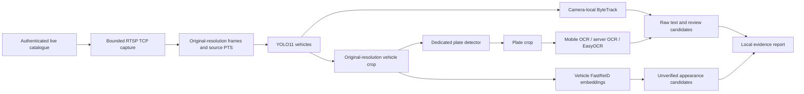

# SYNETRA vision model lab

An independent Python environment for testing the selected non-LLM models on the configured Sentinel feeds. Production backend/frontend code is untouched. Weights, caches and captured footage stay under this folder and are ignored by Git.

Previous generated benchmark runs and findings were deleted at the user’s request. The fresh benchmark requested 30 supplied cameras for 30 minutes, but stopped at 1,350.09 seconds after feed authentication failures and an idle-detector watchdog timeout. All 30 cameras received inference before the outage. It processed 7,667 frames and completed 901 OCR jobs; 84 selected candidates represented 58 distinct strings, with no exact cross-camera matches. This is an incomplete benchmark, not a successful 30-minute run. [Reports](runs/live_30cams_30min_fresh_v1/report.html), [JSON bundle](runs/live_30cams_30min_fresh_v1/report.json), and [validation](runs/live_30cams_30min_fresh_v1/validation.json) preserve the evidence. The idle heartbeat bug is fixed for the next run; vendor access must be restored first. See [optimized workflow](OPTIMIZED_WORKFLOW.md) and [encounter storage](ENCOUNTERS.md).

## Installed model stack

| Stage | Models installed | Execution |
|---|---|---|
| Vehicle detection | Ultralytics YOLO11n and YOLO11s, official COCO checkpoints | PyTorch / Apple MPS on this laptop; CPU also supported |
| Camera-local tracking | Ultralytics ByteTrack implementation | CPU; one tracker per camera, reset at PTS discontinuity |
| Plate detection | MorseTech YOLO11n and YOLO11s plate-trained weights, both `.pt` and `.onnx` | `.pt` tested on MPS; both ONNX exports smoke-tested on CPU |
| OCR | Paddle `en_PP-OCRv5_mobile_rec`, `PP-OCRv5_server_rec`, EasyOCR English | CPU, one OCR model per process |
| Vehicle appearance | Official FastReID VeRi SBS R50-IBN | CPU, RGB 256×256 crops; 2,048-dimensional embeddings |

FastReID remains installed but is disabled in the current workflow by user choice; TransReID was its fallback alternative and is not needed alongside it. ByteTrack has no separate weights. DeepStream/TensorRT are NVIDIA deployment runtimes, not models, and are not installed on the M2. Both Qwen LLM and Qwen VLM are excluded.

The plate detector's author reports contaminated train/test splits. No upstream accuracy is treated as evidence of performance here. See `model_manifest.json` for exact model revisions, sources and SHA-256 hashes, and `requirements-lock-macos-arm64.txt` for installed packages. FastReID source is pinned to `c9bc3ceb2f7a6438b62fb515ea3df6d1e999e95d`; its older official checkpoint's classifier key is mapped to the current implementation and inference weights are checked for missing/unexpected keys.

## Workflow



Capture and inference are separate to compare models on **identical real inputs** and limit RAM. These tests are sequential captured-feed replays, not simultaneous live-camera capacity tests. Stream PTS and receipt UTC are stored separately. They do not establish absolute camera capture time or a true cross-camera route. The feeds show recorded timestamps in their images; capture time is not the scene's event time.

Vehicle boxes are detected at 640 input size; plate detection uses full-resolution vehicle crops. Every detection and plate crop is retained. OCR stores raw readings, scores, and a two-line midpoint hypothesis for appropriate aspect ratios. It does not substitute ambiguous characters or force a valid registration. Track consensus remains a review candidate; no watchlist updates, alerts, or production records are written. ReID similarities never assert identity.

## Setup

Already installed here in `.venv`. To reproduce on macOS ARM64 with Python 3.12 and `uv`:

```bash
bash model_lab/setup.sh
```

The setup downloads packages/checkpoints; inference then uses local paths. For Linux/AWS, resolve `requirements.txt` in a new environment and install a PyTorch build appropriate to the chosen CUDA runtime. This laptop run does not validate AWS performance or an NVIDIA deployment.

The credentials are read from the existing `backend/.env.registry` at runtime. Do not copy them into a source file. Use `--env-file` and `--profile` for another configured connector. Outputs omit credential-bearing URLs and exception text.

## Run from repository root

Capture a short bounded sample from every camera in the real catalogue:

```bash
model_lab/.venv/bin/python model_lab/capture_feeds.py \
  --frames 6 --sample-fps 2 --timeout 8 \
  --output model_lab/runs/new_capture
```

Use a fresh output directory each time. A separate decoder process enforces a hard deadline per camera. Partial captures, decode errors, timeouts and refused connections remain visible. For a tracking-focused sample, use `--cameras cam06 --frames 100 --sample-fps 10` with a new output directory. These IDs must exist in the current catalogue.

Run detection and tracking:

```bash
model_lab/.venv/bin/python model_lab/run_pipeline.py \
  --capture model_lab/runs/new_capture --output model_lab/runs/new_nano \
  --vehicle-size n --plate-size n
```

Use `--vehicle-size s --plate-size s` and another output directory for the small models. `--device cpu` avoids MPS. High-resolution or dense frames incur one plate inference per detected vehicle; this is a baseline, not a batched production worker. Low sampling rates can fragment tracks and are not a tracking accuracy benchmark.

Compare OCR and generate vehicle embeddings:

```bash
for model in mobile server easyocr; do
  model_lab/.venv/bin/python model_lab/run_ocr.py \
    --run model_lab/runs/new_nano --model "$model"
done
model_lab/.venv/bin/python model_lab/run_reid.py \
  --run model_lab/runs/new_nano --max-crops 100
model_lab/.venv/bin/python model_lab/build_report.py --run model_lab/runs/new_nano
```

ReID selects one crop per known local track and otherwise individual untracked detections, up to the declared cap. It is a runtime/embedding smoke test, not verified cross-camera retrieval accuracy.

## Outputs

- `runs/<capture>/manifest.json`: camera availability, codec, frame sizes, PTS, receipt UTC, errors; frame JPEGs beside it.
- `runs/<run>/report.html`: local annotated frames and plate/OCR comparison; no external assets.
- `detections.jsonl`: vehicle boxes, local track IDs, plate candidates and individual stage latency.
- `ocr_*.jsonl`, `ocr_*_summary.json`: raw readings, alternatives, counts and latency.
- `reid.json`, `reid_embeddings.npy`: embeddings and ranked, unverified appearance candidates.
- `summary.json`: model hashes, device, thresholds, counts and detection timing.
- `RESULTS.md`: measured findings from this session and known gaps.

Timings for detection include vehicle/tracker inference, sequential plate inference and crop writes; final annotated-frame writes and OCR/ReID are excluded. Models are warmed up before detection timing. OCR timings include its first inference and any two-line hypotheses. These definitions differ and must not be added as an end-to-end alert latency claim.

Run integrity and coordinate checks:

```bash
cd model_lab
.venv/bin/python -m unittest test_lab -v
```

These unit tests use synthetic coordinates only for software checks. All retained evaluation frames come from the authenticated feeds. There are no synthetic operational detections or fallback plate numbers.

## Sources

- [YOLO11](https://docs.ultralytics.com/models/yolo11/) — Ultralytics AGPL licensing.
- [Plate model card](https://huggingface.co/morsetechlab/yolov11-license-plate-detection) — AGPL-3.0; dataset leakage warning.
- [Paddle mobile OCR](https://huggingface.co/PaddlePaddle/en_PP-OCRv5_mobile_rec) and [server OCR](https://huggingface.co/PaddlePaddle/PP-OCRv5_server_rec) — Apache-2.0 model cards.
- [EasyOCR](https://github.com/JaidedAI/EasyOCR).
- [FastReID vehicle model zoo](https://github.com/JDAI-CV/fast-reid/blob/master/MODEL_ZOO.md#veri-baseline).
